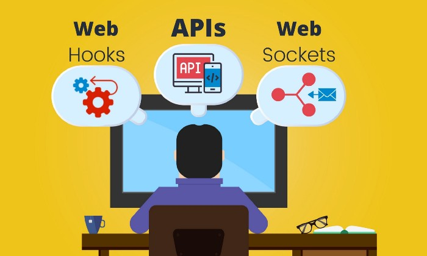
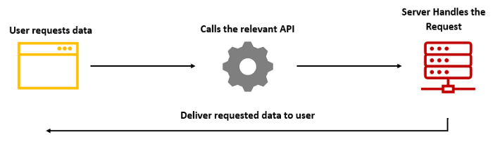
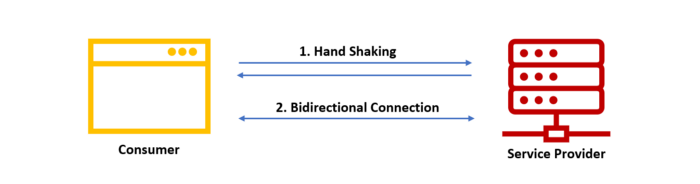
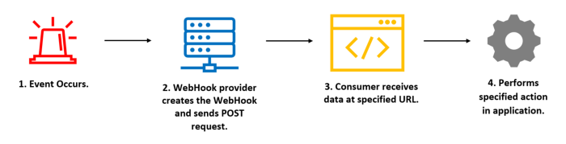

# APIs vs Websocket vs Webhook

  

## APIs:
API or Application Programming Interface is a contract between a consumer and the service provider who exposes the API typically over HTTP.
This works exceptionally well for scenarios like basic CRUD operations from the web, mobile, or even for service to service integrations. Mostly the communications happen using JSON or XML as the data transfer format.

  

## Websockets:
WebSockets, address this challenge by allowing a persistent and bidirectional communication between the consumer and service provider.
Having a full-duplex communications channel allows service providers to send messages at any time. Since all the modern browsers support WebSockets, it is the best solution for real-time web applications.

  

## Webhooks:
WebHooks provides a solution for the overkilling issue in WebSockets by providing a disconnected mechanism to receive a response originate from the service provider.
If we look at the technical side, the consumer registers the WebHook (callback URL) into the service provider, and that URL will act as the place to receive data from WebHook.

In most cases, this URL belongs to another server, and WebHooks are mostly used to communicate between servers or backend-processes.
If we dig deep into the process, we can break this process into four parts.

  

[Read More](https://blog.bitsrc.io/apis-vs-websockets-vs-webhooks-what-to-choose-5942b73aeb9b)

## Conclusion
As I have mentioned initially, WebHooks, WebSockets, and APIs facilitate communication; they have various use cases.

APIs are the best option for applications where you just need basic CRUD operations and synchronous responses. Also, APIs can be used with both web and mobile applications and service integrations with ease.

But, if your web application requires real-time communication with the backend, you should choose WebSockets. It allows you to establish a 2-way communication channel between your browser and the backend.

However, WebHooks are slightly different from APIs and WebSockets, which is more like a reverse API. Once the Consumer registers the WebHook URL in the service provider, the latter can call the WebHook when required.