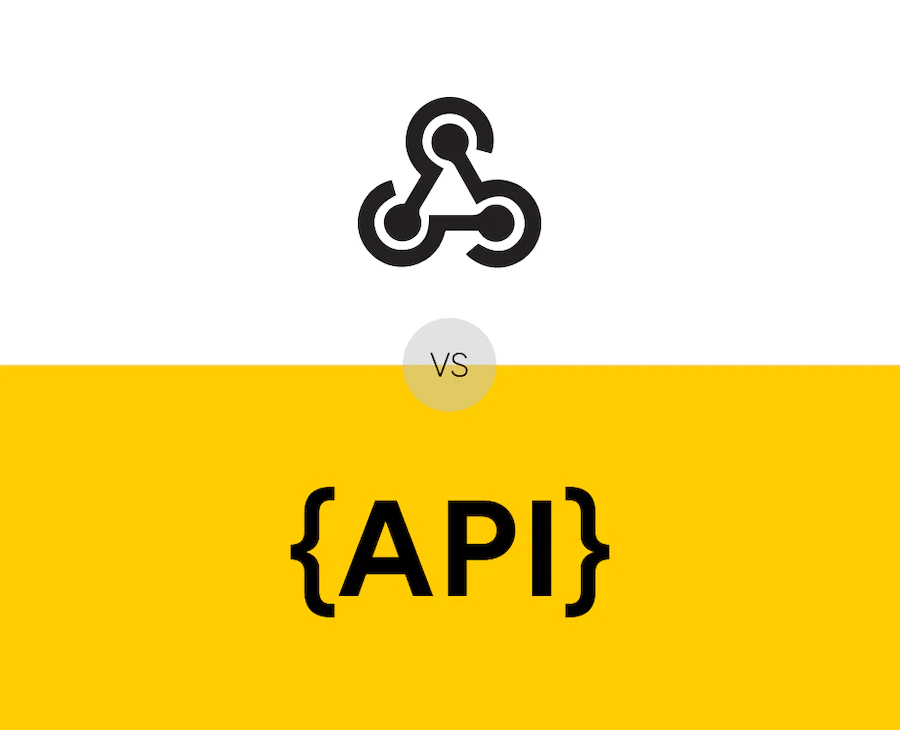

# WebHooks vs API
An all-in-one repo exploring concepts of DevOps

  

## What is an API?
API stands for Application Programming Interface. It defines the interactions between multiple software applications. It allows you to set the kinds of polls or requests that can be made, how to make them, the format of the data used, etc.

In the web development world, we often use APIs accessed through the Internet to communicate to external applications.

OK, so that might be a little hard to follow. Bear with me here; we’re going to translate it into simple English in a second.

## What is a webhook?
A webhook is an event-based API endpoint responsible for triggering internal functions to look up information in real-time when a specific event occurs. In web development, it's used to augment or change how a web page or web application behaves via custom callbacks.

These callbacks may be maintained, modified, and managed by third-party users and developers who may not necessarily be affiliated with the originating website or application. The format is usually JSON. The request is done as an HTTP POST request."

[Read More](https://snipcart.com/blog/webhook-vs-api)