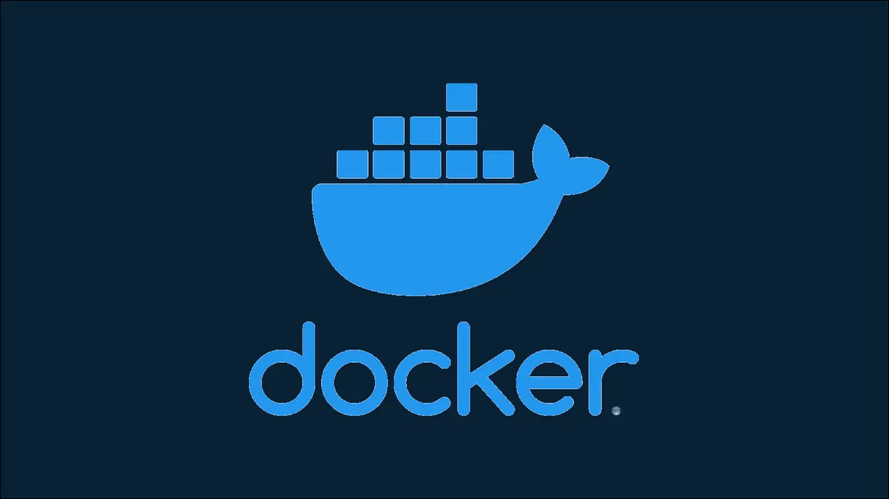

# Docker
Learn docker the easy way

## Installation
Install Docker based on your OS `https://docs.docker.com/get-docker/`


## Run Docker:
Once installed, docker runs as a daemon for Mac and Linux.
For Windows Docker needs a hypervisor (Hyper-V or WSL)

To check docker is installed correctly, run the hello-world image

        docker run -d -p 80:80 docker/getting-started


## NGC Docker Installation (Docker with GPU Acceleration)
For installing docker with GPU acceleration, Nvidia came up with NGC Docker with NVIDIA CUDA software stack on WSL 2. Read full [Documentaion](https://docs.nvidia.com/cuda/wsl-user-guide/index.html)

Architecture:
- Here is an image to give the brief overview of the architecture


Pre-Installation:
- Proceed over to Section 2.7 Running CUDA Containers of the CUDA WSL Documentation.
- Exectute each command in each subsection of this section upto `2.7.5 Jupyter Notebook`. Don't Run Subsection 2.7.5 as we will replace it with Nvidia-NGC Docker image.
- Again all of the commands are subject to change in the future in the actual documentation but for now here's a summary.
- Run each of the following inside WSl Ubuntu instance. (It is recommended to run each command one-by-one as to identify the issue if anything goes wrong)
```bash
    curl https://get.docker.com | sh
    distribution=$(. /etc/os-release;echo $ID$VERSION_ID)
    curl -s -L https://nvidia.github.io/nvidia-docker/gpgkey | sudo apt-key add -
    curl -s -L https://nvidia.github.io/nvidia-docker/$distribution/nvidia-docker.list | sudo tee /etc/apt/sources.list.d/nvidia-docker.list
    curl -s -L https://nvidia.github.io/libnvidia-container/experimental/$distribution/libnvidia-container-experimental.list | sudo tee /etc/apt/sources.list.d/libnvidia-container-experimental.list
    sudo apt-get update && sudo apt-get install -y nvidia-docker2
    sudo service docker stop
    sudo service docker start
    sudo usermod -aG docker $USER
```
- Now to check whether installation was correct or not.
```bash
sudo docker run --gpus all nvcr.io/nvidia/k8s/cuda-sample:nbody nbody -gpu -benchmark	# sudo won't be necessary once you reboot or restart WSL Instance.
```
- The above should give the output of your GPU and CUDA Compute capability.

Post-Installation:
- Once thats done Go to https://ngc.nvidia.com/catalog/containers/ and search for your Container of choice. I would recommend going with Tensorflow and then Installing PyTorch on it as usual but you can choose whatever you want.
- And as always, the commands might change in the future so look out on the official documentation. But here's my 2 cents.
```bash
docker run --gpus all -it --shm-size=1g --ulimit memlock=-1 --ulimit stack=67108864 -p 8888:8888 nvcr.io/nvidia/tensorflow:21.07-tf2-py3
```
- Now you might get a fake error saying Nvidia-GPU not detected at this point and it is absolutely okay. This is a limitation which is being currently fixed as time goes by, no need to worry about.
- To check whether your GPU is actually detected or not, execute the following and observe the output.
```bash
python -c "import tensorflow as tf; tf.config.list_physical_devices('GPU')"
```
- The output of the above will contain your GPU listed along with the Memory size and other details.
- Now if everything went good, launch `jupyter lab` withing the running docker instance withing the Ubuntu WSL instance.
- At this point you will see jupyter lab running and an URL is given at the end like this : `http://hostname:8888/?token=e5269ca8c6be83ce9c624c11708d0553d25ee1f1595233fd`
- Copy this URL in your browser and replace the `hostname` with localhost so that it ultimately becomes `http://localhost:8888/?token=e5269ca8c6be83ce9c624c11708d0553d25ee1f1595233fd`
- And press Enter in your browser, now you should see Jupyter Lab instance Pop Up just fine.
- First thing to do is, click on the `Terminal` tile in the Jupyter Lab workspace and launch a terminal just for future works with the terminal or you can do whatever you like.
- Now you have a full fledged linux system running NVIDIA-NGC inside Docker inside WSL on Your Windows device.


Parting Notes:
- The Docker Daemon inside the WSL instance isn't started automatically. So if you close WSL or reboot, you need to relaunch WSL Ubuntu instance and then run `sudo service docker start`
- Or You can autostart Docker Daemon if you need it always (Not Recommended) By executing this line inside WSL Ubuntu instance outside the Docker Container:
```bash
echo 'sudo service docker start' >> ~/.bashrc
```
I repeat DO NOT Run this command inside Docker Container.
- Finally Reboot once and make sure everything is Working as expected.
