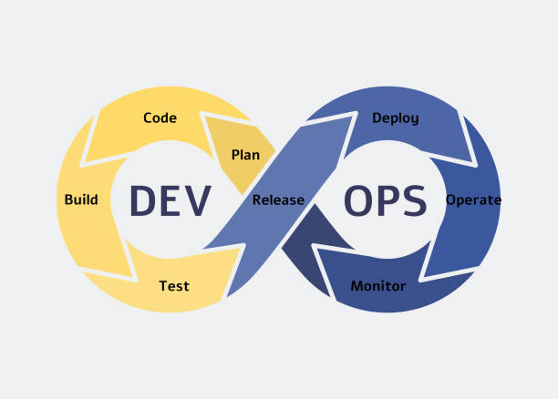

<link rel="shortcut icon" type="image/x-icon" href="favicon.ico">

# learning-devops
An all-in-one repo exploring concepts of DevOps

  

## DevOps Roadmap

1. Learn a programming language:
	- Python
	- NodeJS
	- GoLang

2. Understanding OS Concepts:
	- I/O Management
	- Virtualization
	- Memory/Storage
	- File Systems
	- Sockets
	- Processes
	- Startup Management (initd)
	- Service Management (systemd)
	- Threads and Concurrency

3. Learn about managing servers:
	- Intro to System Admin
  
	- OS:
		- Linux Distros (Ubuntu,CentOS,RHEL,Debian,Fedora,SUSE)
		- Unix (FreeBSD,OpenBSD,NetBSD)

	- Terminal:
		- terminal multiplexers (tmux)
		- Process monitoring (ps,top,htop,atop,lsof)
		- System Performance (nmon,iostat,sar,vmstat)
		- Network tools (traceroute,mtr,ping,nmap,netstat,airmon,ufw,tcpdump,airodump,iptables,dig,scp)
		- bash scripting
		- Vim/Nano/Powershell/Emacs
		- Compiling apps from source (gcc,make)
		- Text Manipulation (awk,sed,grep,sort,cut,uniq,cat,echo,fmt,tr,ni,wc,egrep,fgrep)
		- Others (strace,dtrace,systemtap,uname,df,history,du)

4. Networking, Security and Protocols:
	- OSI Models
	- White/Grey Listing
	- DNS
	- Emails (SMTP,IMAPS,POP3S) | DMARC, SPF, Domain Keys
	- HTTP,HTTPS,FTP,SSL/TLS,SSH,Port Forwarding

5. What is and how to setup a _______ ?
	- Reverse Proxy
	- Forward Proxy
	- Firewall
	- Caching Server
	- Load Balancer
	- Web Server (Apache,Caddy,Tomcat,IIS)

6. Infrastructure as Code (IaC) Concepts:
	- Service Mesh (Consul,Istio,Envoy,Linkerd)
	- Conainers (Docker,LXC)
	- Configuraton Management (Ansible,Chef,Salt,Puppet)
	- Container Orchestration (Kubernetes,Mesos,Docker Swarm,Nomad)
	- Infrastructure Provisioning (Terraform,AWS CDK,CloudFormation,Pulumi)

7. Learn some CI/CD tools:
	- Gitlab CI
	- Jenkins
	- Github Actions
	- Circle CI
	- Bitbucket CI
	- Travis CI
	- Azure DevOps Services
	- TeamCity
	- Bamboo

8. Infrastructure Monitoring:
	- Prometheus
	- Grafana
	- Datadog
	- Nagios
	- Zabbix
	- Monit

9. Application Monitoring:
	- Jaeger
	- New Relic
	- AppDynamics
	- Instana
	- OpenTelemetry

10. Logs Management:
	- Elastic Stack
	- Graylog
	- Splunk
	- Papertrail
	- Loki

11. Cloud Providers:
	- AWS
	- Google Cloud Platform
	- Digital Ocean
	- Azure
	- Linode
	- Heroku
	- Vultr
	- Alibaba Cloud

12. Cloud Design Patterns:
	- Availability
	- Data Management
	- Design and Implementation
	- Management & Monitoring

## Contents:
1. Blogs:
    - [Webhooks-vs-APIs](Blogs/Webhooks-vs-API.md)
    - [APIs-vs-Webhooks-vs-Websockets](Blogs/APIs-vs-Webhook-vs-Websocket.md)
    - [Ngrok-with-implementation](Blogs/NGROK.md)
    - [Nexus Repository](Blogs/Nexus-Repository.md)

2. Tools:
    - [Docker](Docker/README.md)
    - [Jenkins](Jenkins/README.md)

## References:
- `https://roadmap.sh/devops` by [@kamranahmedse](https://github.com/kamranahmedse)

